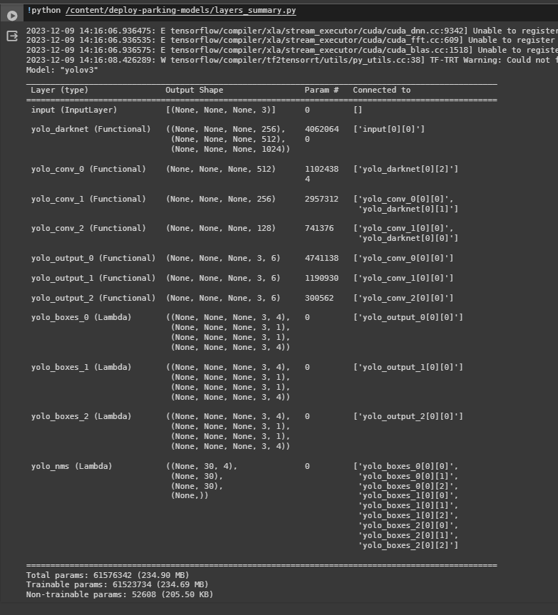

# IoTCameraAnalytics
Building a web dashboard to monitor the usage of parking area and meeting room using machine learning


Yolov3 Custom dataset final product : 
https://colab.research.google.com/drive/12Q-C6Ga93Od27cnzotWMPncvwXCpu1LO?usp=sharing

The process of training a custom dataset model that utilizes storage drives:
https://drive.google.com/drive/folders/1pJFGKdozDHO2j-OryDAubuwhTY9xcGsN?usp=sharing

## finally after training the pre-trained models, Converted to tensorflow(.h5) format and then can see the trainable layers :


## Step by Step
Please Make sure you've already have dataset whichis the contain is annotated by yolo format using labelimg

1. Set runtime type using python3 and select hardware accelerator T4 GPU
2. Run the following command to activate GPU in google colab
   
```bash
!nvidia-smi
```
3. Utilize existing storage on Google Drive

```bash
from google.colab import drive
drive.mount('/content/drive')
```
4. for the preparation need some configure from Yolov3 darknet official repo:
```bash
!git clone https://github.com/AlexeyAB/darknet.git
```

5. set for configure and compile the repo
```bash
%cd /content/darknet/

!sed -i 's/OPENCV=0/OPENCV=1/' Makefile
!sed -i 's/GPU=0/GPU=1/' Makefile
!sed -i 's/CUDNN=0/CUDNN=1/' Makefile

!make
```
6. set Pre-Trained configure layers and adjust the data already annotated
7. copy the file configuration (.cfg) to local storage(gdrive)
8. load your dataset and extract the zip dataset to directed in gdrive storage
9. download PRE-TRAINED yolo weights https://pjreddie.com/media/files/darknet53.conv.74
10. Train your customize dataset with pre-tarain models
```bash
%cd ../../
!cd darknet && ./darknet detector train data/obj.data cfg/yolov3_training.cfg darknet53.conv.74 -dont_show
```
from that repo I only did the GPU configuration and working environment, and customized the .cfg file to fit my dataset the process directed to my local drive, and I also Utilize the training procces in colab with existing pre-trained Yolov3 darknet 

## Improvements
after all the processes from the steps above it will produce (.weights) as yolov3 format, where the training results file will be converted to tensorflow (.h5) format and that has been successful,
I wanted to make additional custom Dense Layer but I think it will take a lot of time

and then the format is used to carry out inference prediction which is done at : 
https://github.com/C23CA01/deploy-parking-models

## several failed development attempts
- https://colab.research.google.com/drive/1u6zNZDtFcMFJ6-wIZwHRxpFovz-jo3ab?usp=sharing
- https://colab.research.google.com/drive/1gPinDGV--SQj29wrdRhnrh4wgeJwmIf7?usp=sharing
